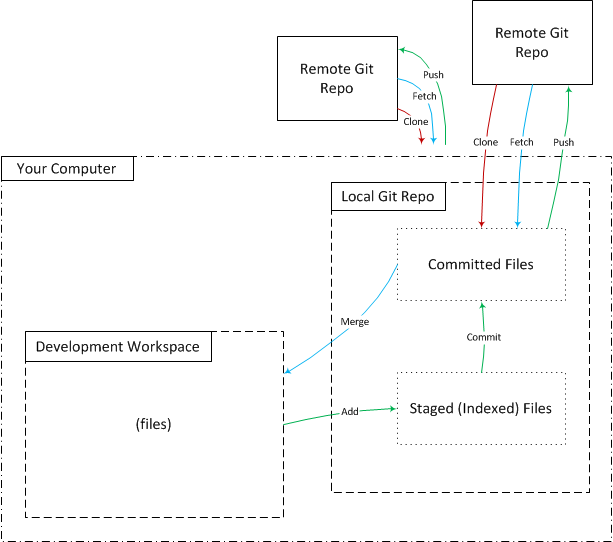

# Git! Version Control Software:

Hey Folks! Congratulations on finishing your Day 0, and today I am going to introduce a tool named Git.

## Github VS Git:
First of all everybody, many people are having misconcepts of Git and Github, so I thought of clearing the doubt.

> First of all, GitHub is not git. Many people understandably confuse the two. GitHub is a website for hosting projects that use git.

## What is Git?
Git is a type of **version control system (VCS)** that makes it easier to track changes to files. For example, when you edit a file, git can help you determine exactly what changed, who changed it, and why.

## Why use git?
* It’s useful for coordinating work among multiple people on a project, and for tracking progress over time by saving “checkpoints”.

* Many software developers use git daily, and understanding how to use it can give a major boost to your resume.

## Now let's understand Git-


Above picture gives a very clear idea of how Git works!

But before we dive into actual Git, let's introduce ourselves with some of the **jargons**:

* **Repository**-  The purpose of Git is to manage a project, or a set of files, as they change over time. Git stores this information in a data structure called a repository.

> About the .git folder inside the git repository: This is a hidden .git folder inside your current folder where git stores all of its internal tracking data.

Git has two repository types: 

1. **Local Repo**- The local repo is on your computer for only your direct use. It has all the files and their commit history, enabling full diffs, history review, and committing when offline.  This is one of the key features of a “distributed” version control system (DVCS), locally having the full repository history.

2. **Remote Repo**- The remote repo is typically elsewhere and for your indirect use. Git refers to the centralized server as a “remote repository”.  The remote repo is usually not on your machine and is the one shared by the team. The team “pushes” commits to it when ready to share with the team.

* **Fork**- It means to make a copy of the repository (the one being forked) into your account (the account from which you're forking).

* **Clone a Repository**-
The clone command creates a new local repo from the remote repo.  Use this command only once to initially pull the files and history from the remote repo.

Let's clone a repo-
```bash
	$ git clone https://github.com/marvellouschandan/Linux-Workshop
```
> The URL you specify here is called the **remote origin** (the place where the files were originally downloaded from).

* **Add / Stage**- The add or stage command adds the file in its current state to the Git stage area.

* **Commits**- The commit command commits the staged files to the local repo. Commits are a particular type of checkpoint called a **revision**. The name will be a random-looking hash of numbers and letters such as `e093542`.

* **Fetch**- The fetch command retrieves updated files from the remote repo that are not yet in your local repo.

* **Merge**- The merge command merges the contents from the local repo into the workspace.

* **Pull**- The pull command is simply a fetch followed by a merge.

* **HEAD**- HEAD always refers to your latest checkpoint, that is, the latest commit on your current branch.

* **Branch**- A git branch symbolic reference to a single git commit. Branches in Git are nothing but pointers to a specific commit. Git generally prefers to keep its branches as lightweight as possible.

So, I feel that now we are clear with the terminologies and let's start implementing it.

# <AFTER THE PRESENTATION>

## Real life example:
Here’s a series of commands that could hypothetically be executed while developing a real feature:
```bash
	$ git clone https://github.com/marvellouschandan/Linux-Workshop
	$ cd Linux-Workshop
	$ git status
	$ git checkout -b my-new-feature
	$ echo “This is a cool new file” > my-file.txt
	$ git status
	$ git add --all
	$ git status
	$ git diff HEAD
	$ git commit -m “Add my-file.txt”
	$ git status
	$ git log
	$ git push origin HEAD
	$ git checkout master
	$ git pull
```
